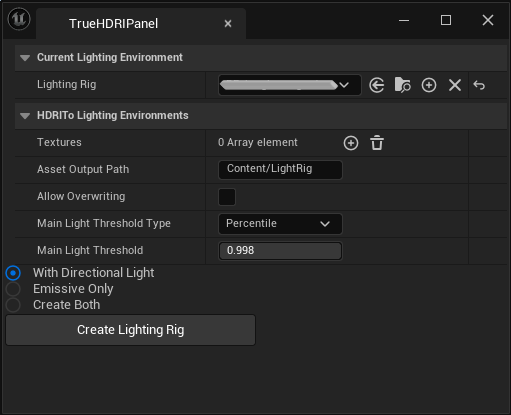

# TrueHDRI-panel
[Japanese docs](./README.md)

An Unreal Engine plugin that creates lighting environments Blueprint from a HDRI sphere texture.

[Fab product page](https://www.fab.com/listings/b65cba4d-e038-4d8a-96fc-73fde41f039e)  
[Demo video](https://www.youtube.com/watch?v=8WYZerzSQr0)

## Features
- Choice of the lighting environment Blueprints to make; one for the game runtime, the other for the path-traced movie production.
  - Material Emissive only, suitable for path-trace renderer production.
  - Converts the brightest part to a Directional Light, best used for normal and Lumen lighting.
- Automation of Sky Light Recapture even with no sky atmosphere in the level.

This plugin has been made in the collaborative research project of [Bandai Namco Studios Inc.](https://www.bandainamcostudios.com/) and [Tokyo Institute of Technology](https://www.teu.ac.jp/).  
TrueHDRI project frontpage: https://www.bandainamcostudios.com/en/projects/truehdri

## How to use

### Setup
1. Create a Plugins folder in the same depth as your project’s .uproject file is.
2. Copy everything inside the plugin distribution zip under the Plugins folder. Final directory structure should look like this:
[Your_Project_Name]/Plugins/TrueHDRIPanel/TrueHDRIPanel.uplugin  

After the installation, launch your project. Under Edit > Plugins window make sure to enable TrueHDRIPanel and OpenCV plugins.  

### Create a Lighting Environment Blueprint from a HDRI
- Preparation of the texture assets
Import your .exr formatted HDRI texture to your Unreal Engine project through normal means.  
\*Make sure that the color space of your EXR image in sRGB. Resulting light color will be inaccurate otherwise.  
Set the Level Of Detail > Mip Gen Settings of your texture asset to NoMipmaps.  

- Open the plugin panel
From Windows > TrueHDRIPanel call the plugin panel.  

Functions related to Blueprint assets generation are sorted under HDRI To Lighting Environments section.

- Generate the Lighting Environment Blueprint asset
Choose any number of HDRI texture assets to be used in
HDRI To Lighting Environments > Textures, and press Create Lighting Rig button.  
\*After creating a With Directional Light, a texture file without the converted brightness (-noSun.exr) will be saved besides the same directory as the original EXR file. Useful for reimporting the UTexture or to be used in any other DCC / game engines. I can also be safely deleted.  

### Set a Lighting Environment on the Level
Inside the plugin panel, **Current Lighting Environment > Lighting Rig**, You can select a Lighting Environment asset created with this plugin and apply that to the level you are working with.  
Sky Light Actor will be created, if none in the level yet, and the Sky Light Capture will be performed automatically every time you change the Lighting Environment asset through the plugin’s UI.

## Generation Parameters
- Asset Output Path：
  - Set the name of the path where the created BP asset will be saved. Always use Content directory as a root directory, which can be omitted.
- Allow Overwriting：
  - Allow creation of the asset which has the same name and the path with an existing asset, and overwrite the asset on creation.
- Main Light Threshold Type：
  - Determines the type of threshold used to separate the brightest area (witch will be extracted and be turned into a directional light value when creating a Lighting Environment with Directional Light option).
    - Percentile; over the specified percentile of value.
    - Percent; over the specified percent of value **between 0 and the MAX value of the image.**
    - Percent Ave Max; same as the above, but between the average and the MAX value of the image instead.
    - Direct Value, directory set the absolute value of pixel to be used as a threshold.
- Main Light Threshold：
  - Value of the threshold, interpreted based on the threshold type chosen above.
- Asset types to create：
  - With Directional Light; extract the brightest parts of the texture to create a directional light.
    - Creates a BP asset with `-Directional` suffix.
  - Emissive Only; Use the provided texture as is, only lit by the material emission.
    - Creates a BP asset with`-PathTrace` suffix.
  - Create Both; Create both types of the assets.  
Depending on the settings, these assets described below will be created:
    - Lighting Environment Blueprint     　     BP_[AssetName]
    - Lighting Environment sphere material　M_[AssetName]
    - (Only with `-Directional`) Texture without the extracted brightness　 [AssetName]-NoSun
